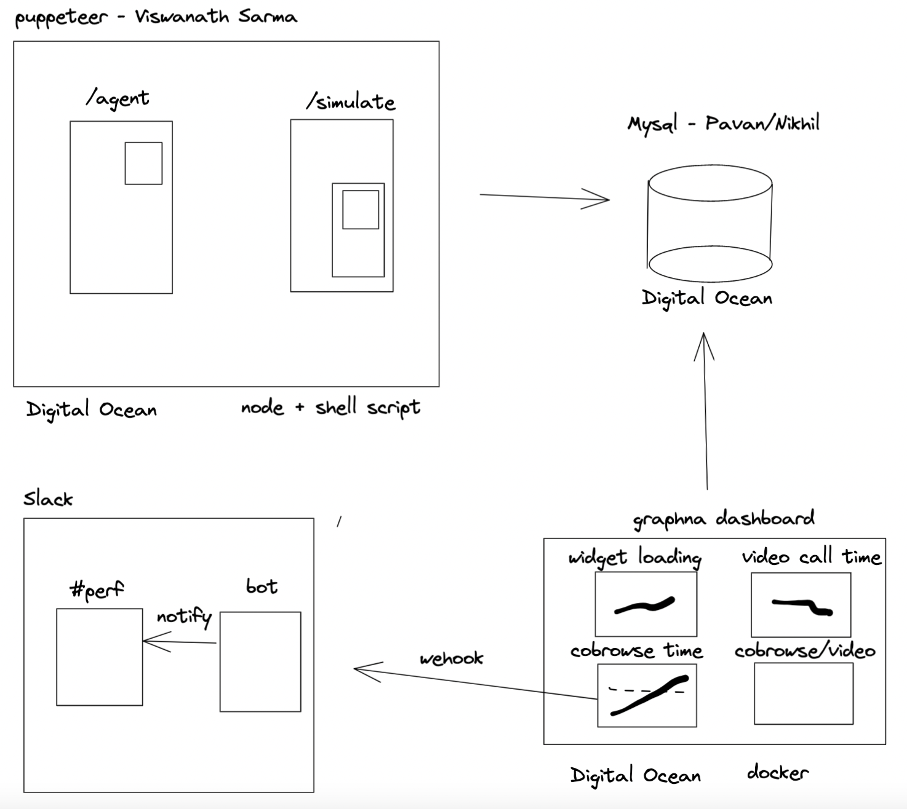

# **Prob System**

  


The user probe is to measure the slowness that agent and widget visitor are experiencing. The measurement was taken on live acquire.io tenant accounts continously. 

The user probe script can be also used to run load tests. 

The MVP system runs as below, 
1. Node program using Puppeteer to load agent and visitor page. It saves the timing data from HAR file to Mysql  database (`sqlScript.sql`). The node program has the following use cases 
   - Widget Chat Load (`/chat_loads`)
   - Video Call (`/video-calls`)
   - Cobrowse (`/cobrowse-scripts`)

<br>


2. Shell scripts utilize the node program to execute in continous (monitoring) or parallel (load test) fasion. 

<br>


3. Grafana queries the Mysql and create the dashboard for data display 
   
   `docker run -d --name=grafana -p 8000:3000 grafana/grafana`

   <br>

4. Grafana sends alert to slack #perf-test if an elevated delay is detected 

<br><br><br>

# **Deployments**
The MVP is deployed on Digital Ocean Server (Node, Mysql and Grafana)

`frank.env.acquire.io:8000`

<br><br><br>


# **Q&A**

## **`How to run node program`**
<br>

Each folder has the script to run for a specific use case.

In each folder `test-puppet.js`, you need to replace the hostname based on the testing environment and you can give the testname based on the test you were performing. Additionally can also specify the pages parameter to test on concurrent users.

logData will be logging your data and metrics will be the json key value pair that has different timinings based on the tests we have performed with the script.

1. `widget-load` - Will be the time taken in milliseconds to load.
2. `page-load` - Will be the time taken in milliseconds to load our page.

Will also be having the time taken in milli seconds for the api calls in case of `init`, `creating chat(create)` and `adding the new messages(add-message)`. Har files data are been using to extact the response time.

The scripts includes the time taken in milliseconds to establish the websocket connection and this is done with dumping of the websockets data. `CRM websocket connection` time and `webrtc socket connection` times and `socket send/receive` frame times were drawn as part of the metrics.

All this will be collected as part of the testing performing and a `metrics` object with these timing values were logged.

<br> 

## **`How to run script`** 
<br>
```nohup ./video.sh > log &```
<br><br><br>

## **`How to debug/modify for different tenant`** 
<br>

- use Ubuntu machine 
- use headless chrome 
  - `const PUPPETEER_OPTIONS = {
  headless: true }`
- check XPATH of HTML element 


